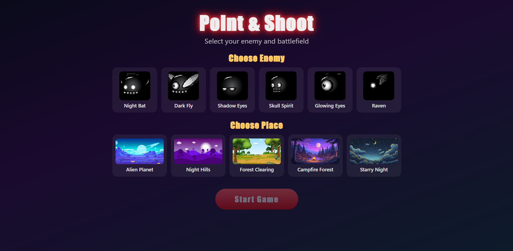

# Point & Shoot Game

    

A fun browser-based point-and-shoot game. Click or tap the flying enemies before they escape!

## How to Play

1. Visit **[Site](https://souravbanerjeedata.github.io/point-and-shoot-game/)** or Open `index.html` in any modern browser (Chrome, Firefox, Safari, Edge).
2. On the start screen, choose an **enemy** and a **place**.
3. Click **Start Game**.
4. Click / tap the enemies to shoot them and score points.
5. You have **5 lives**. Each enemy that flies off the left side of the screen costs one life.
6. When lives reach 0 the game ends. Try to beat your high score!

## Controls

| Platform | Action      |
| -------- | ----------- |
| Desktop  | Mouse click |
| Mobile   | Touch / tap |

## Features

- **6 enemies** to choose from (Night Bat, Dark Fly, Shadow Eyes, Skull Spirit, Glowing Eyes, Raven)
- **5 cartoon backgrounds** (Alien Planet, Night Hills, Forest Clearing, Campfire Forest, Starry Night)
- **5 lives** system with heart indicators
- Speed starts slow and gradually increases every 10 kills (up to a cap)
- Explosion effects and sound
- Fully mobile-friendly responsive UI
